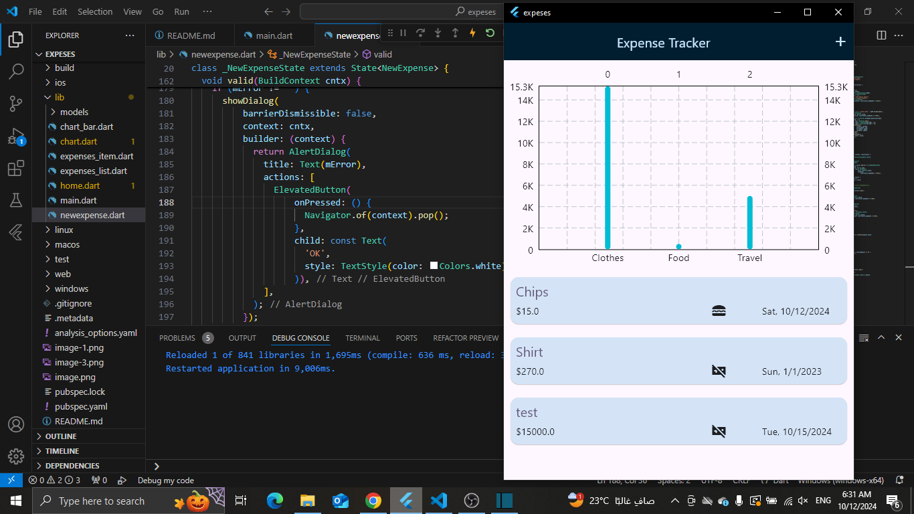
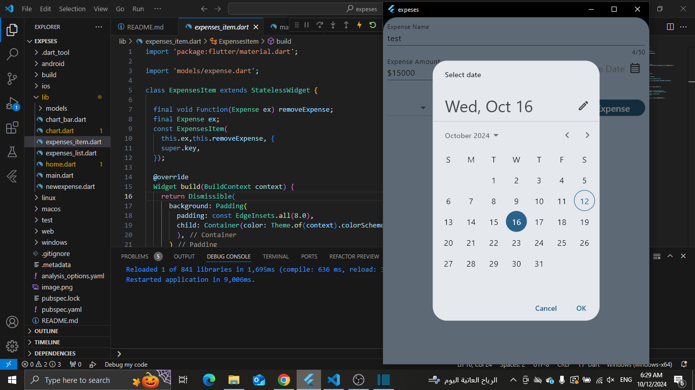
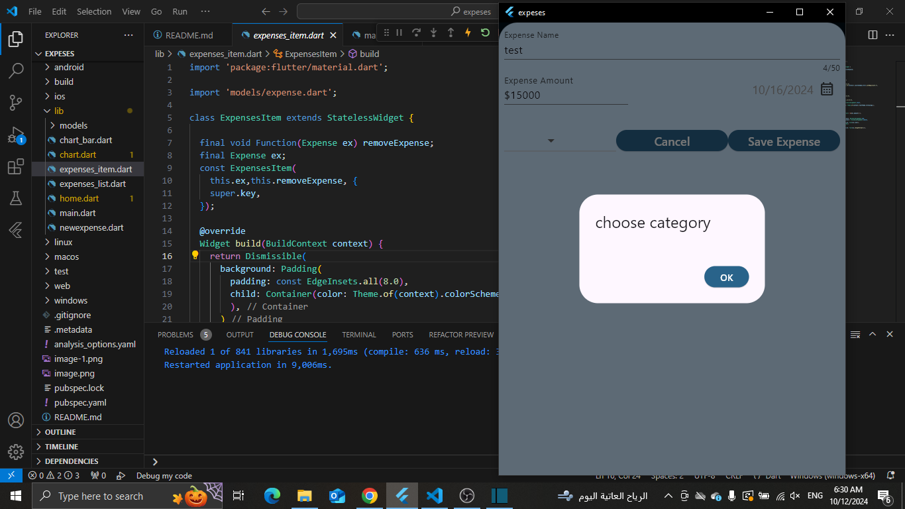
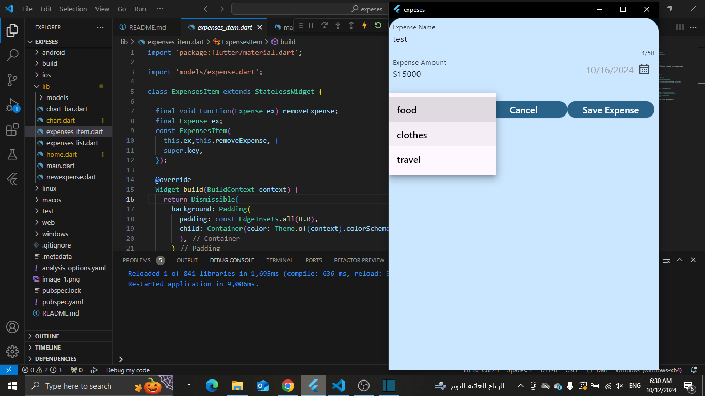
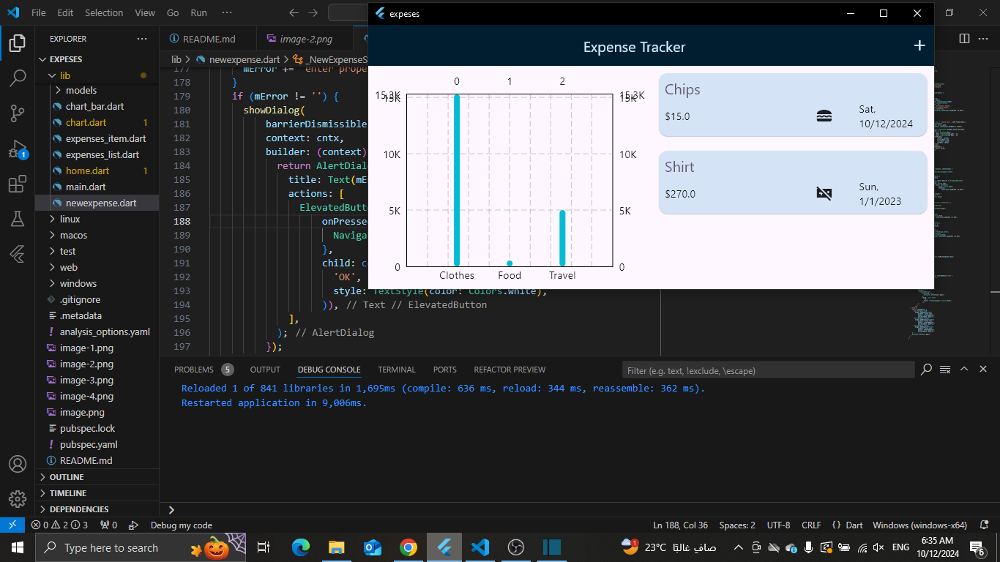

# expeses App

Showing expenses of the  user . Each expense will be added with its title , amount and purchase date then drawing a bar chart 

## This project is a starting point for learning how to use
- Uuid 
- ListView 
- BottomSheet 
- TextField 
- DatePicker 
- DropDownButton 
- AlertDialog
- Dismissible
- Themes
- BarChart
- Responsive app
- Adaptive app

[demo video](https://drive.google.com/file/d/1oLWMC8Pt4OPwgWSgZe2whozIJO9dtTx1/view?usp=drive_link)

