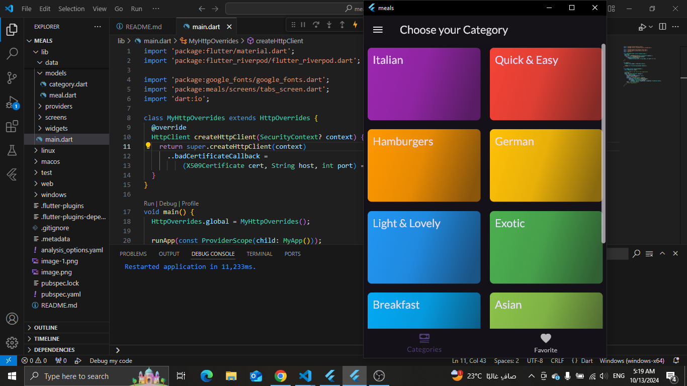
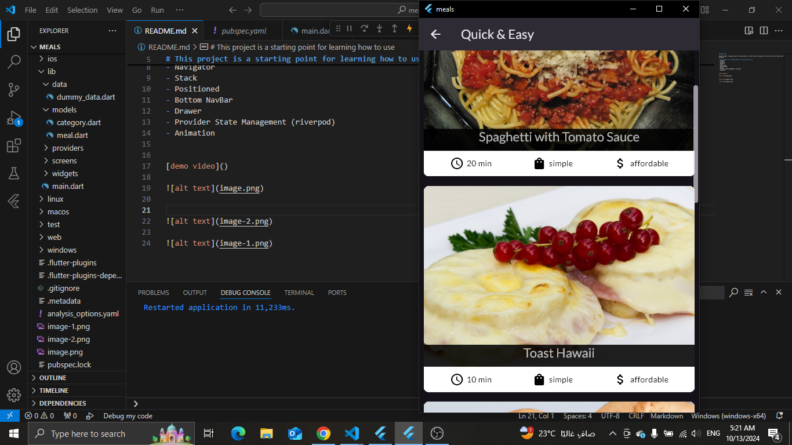
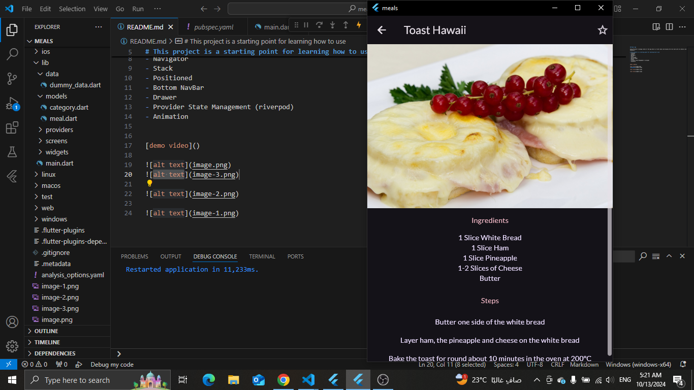
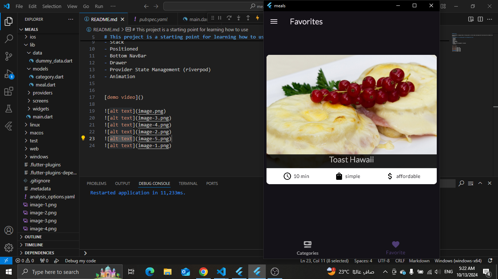
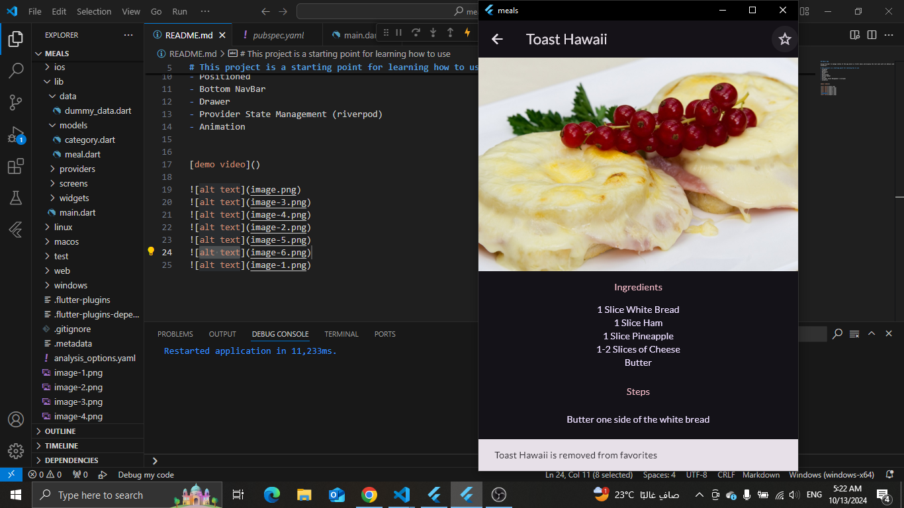
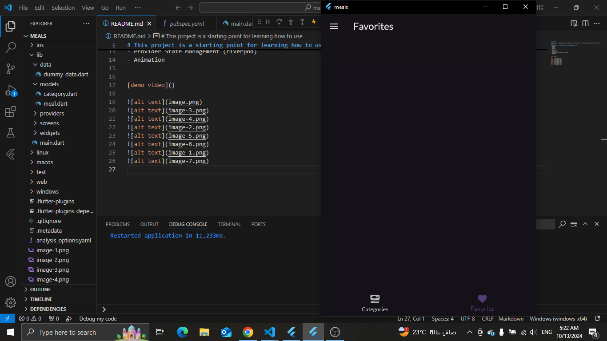
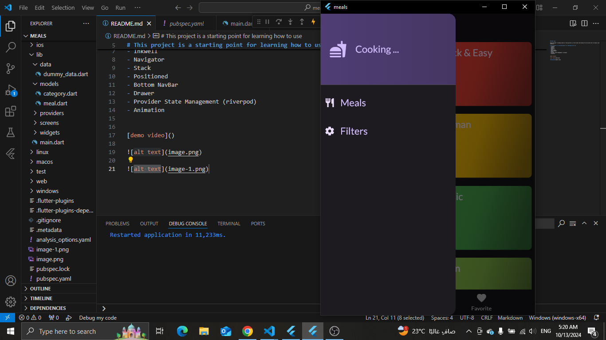
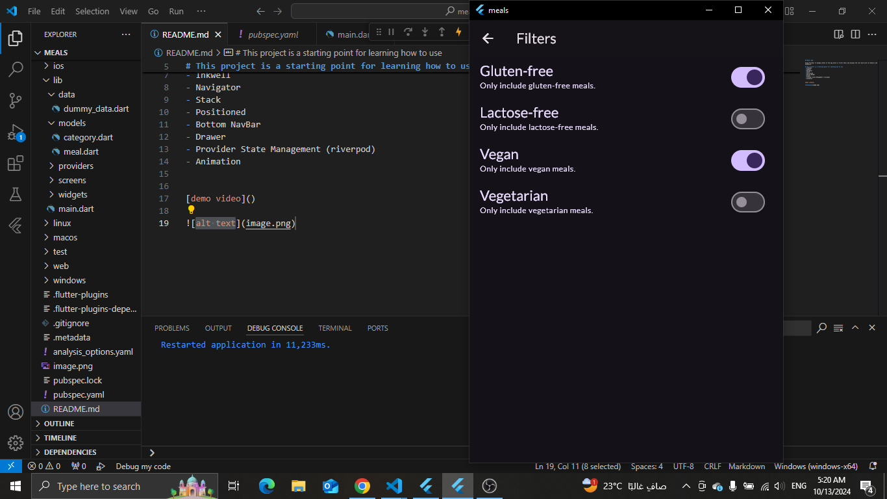
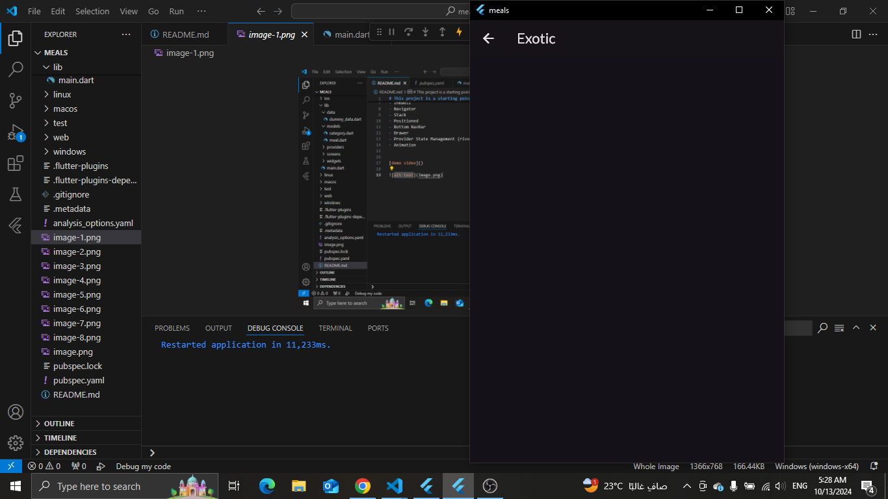

## Meals App

Using Provider to manage states of the app which is filter meals and display the rest each with its details and some animation .

# This project is a starting point for learning how to use
- GridView 
- Inkwell 
- Navigator 
- Stack 
- Positioned 
- Bottom NavBar 
- Drawer
- Provider State Management (riverpod)
- Animation

[demo video](https://drive.google.com/file/d/1ooXwFiWphGXRGEnNmGhjC0uTrbSXdLE9/view?usp=drive_link)

