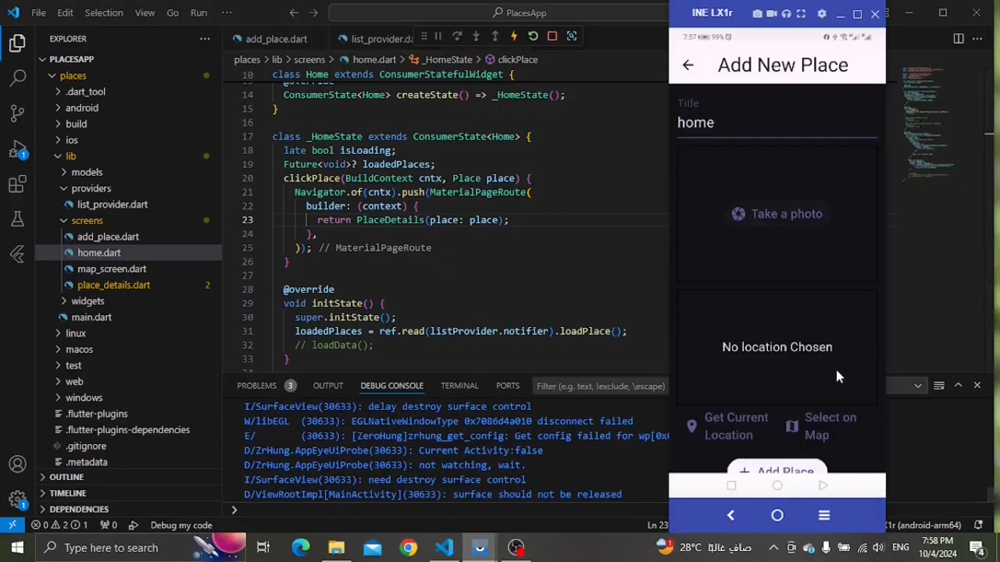
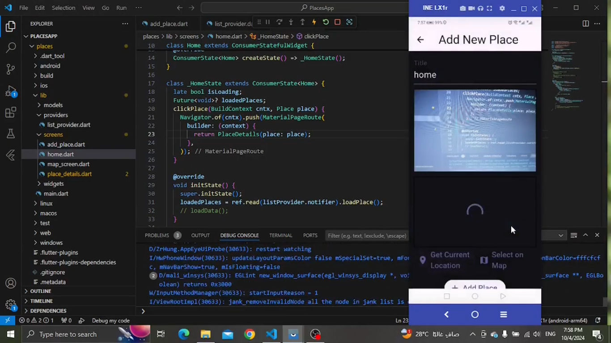
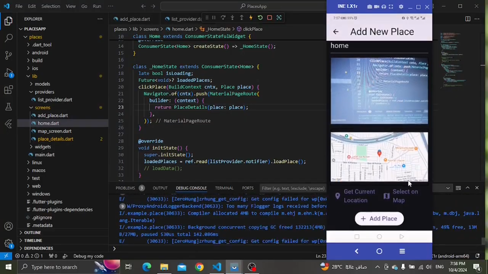
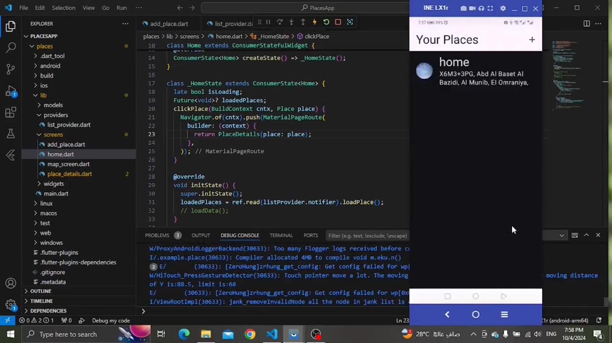
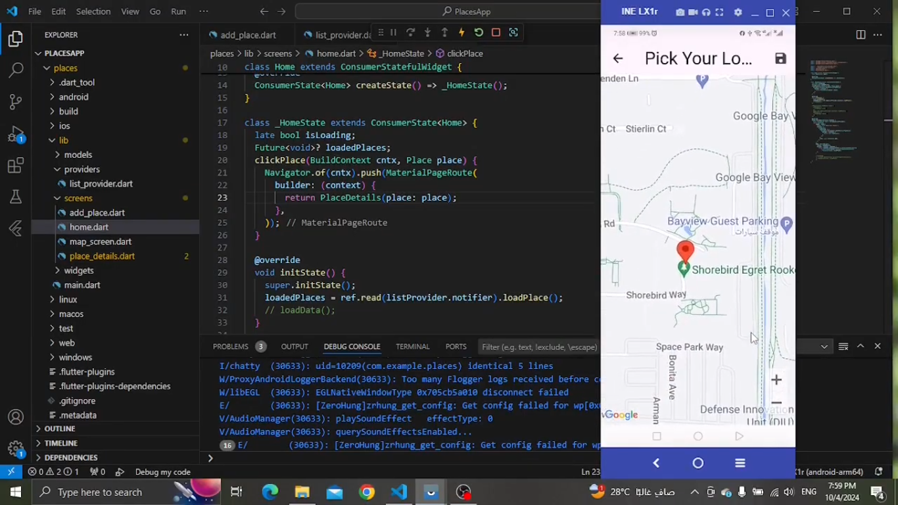
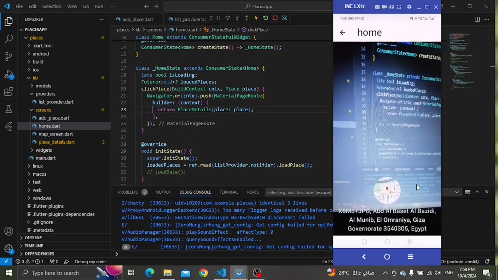
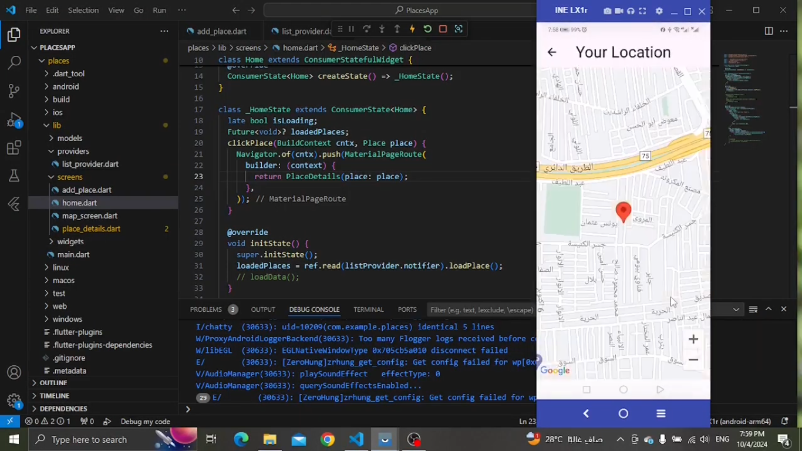

# Places App

Using native mobile features (Camera – gallery – location ) to save user’s places 

## This project is a starting point for learning how to use
- ImagePicker 
- Location 
- path
- path provider
- Google Maps APIs
- SQflite 

[demo video](https://drive.google.com/file/d/1ZbBhDt7opSj6Zmj01qn9xb-RVICsSjeV/view?usp=drive_link)

