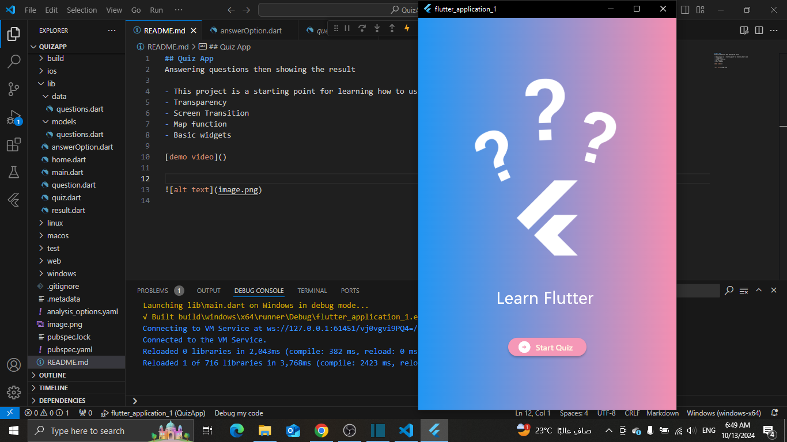
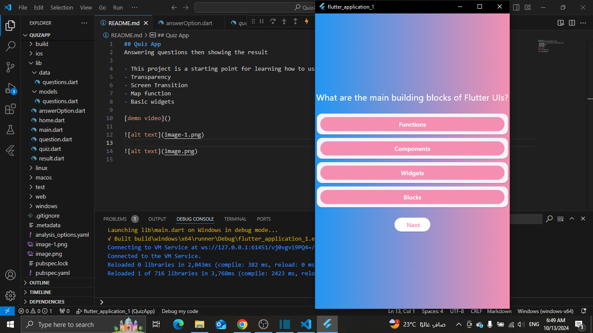
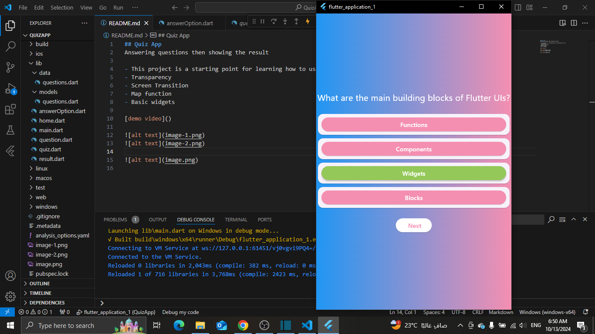
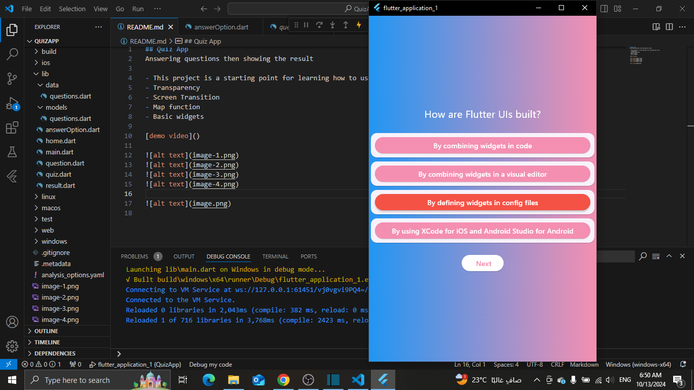
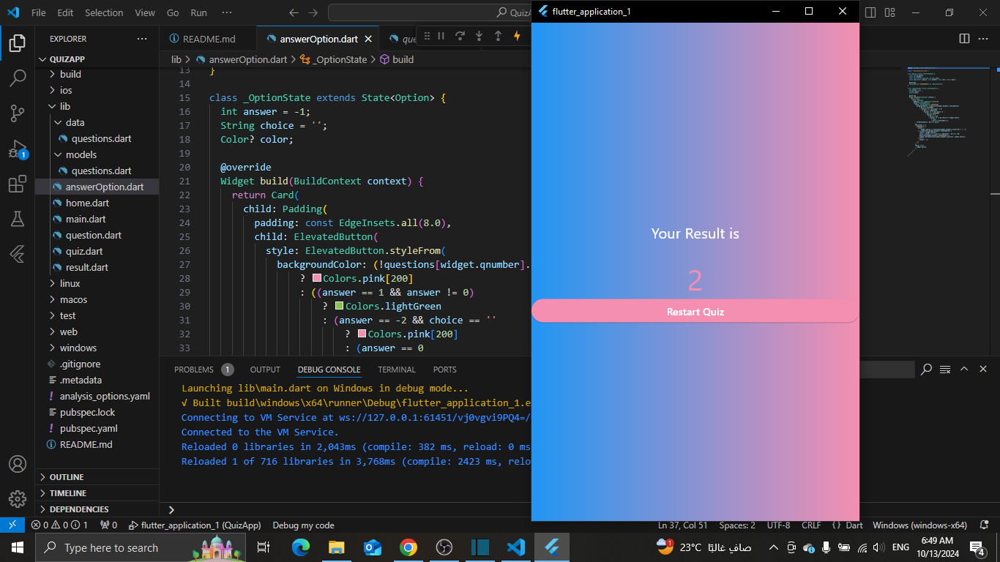

## Quiz App
Answering questions then showing the result

# This project is a starting point for learning how to use
- Transparency 
- Screen Transition 
- Map function 
- Basic widgets

[demo video]()

