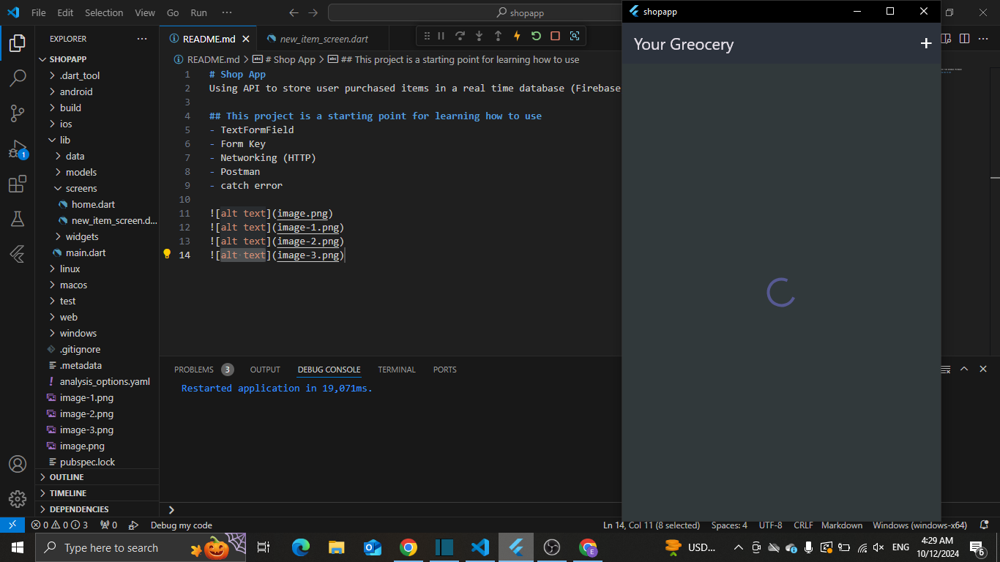
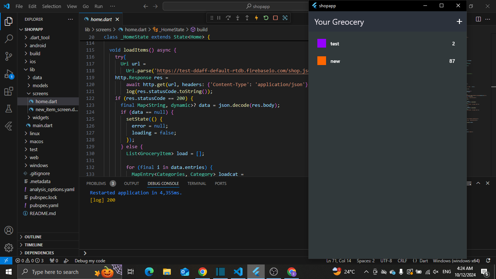
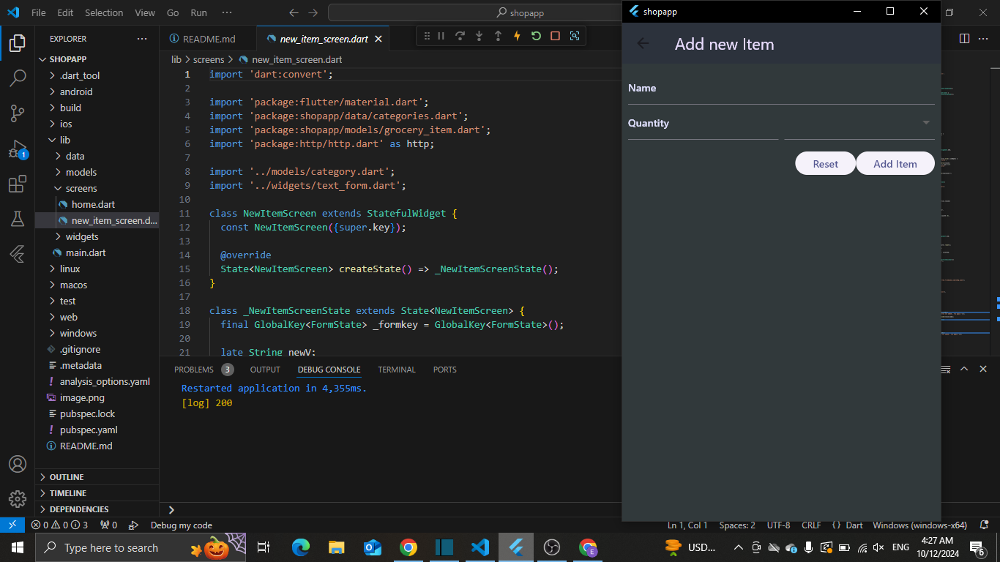
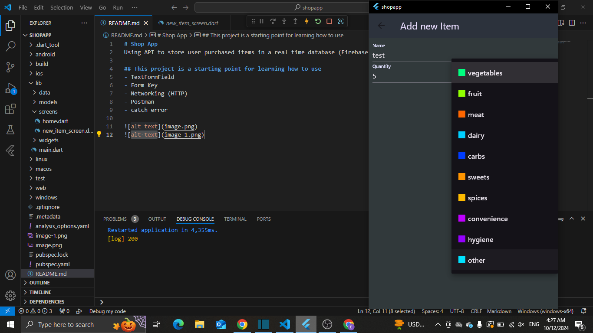
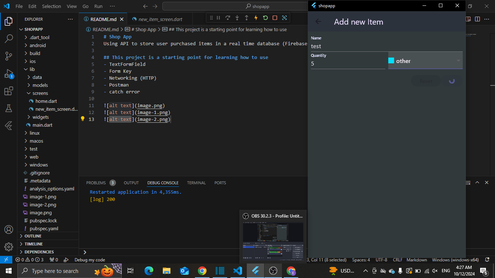

# Shop App
Using API to store user purchased items in a real time database (Firebase) 

## This project is a starting point for learning how to use
- TextFormField 
- Form Key 
- Networking (HTTP)  
- Postman 
- catch error 

[demo video](https://drive.google.com/file/d/1b8YUkkLJVeZX_HQchNDzQJZD4Rh5Br67/view?usp=drive_link)

