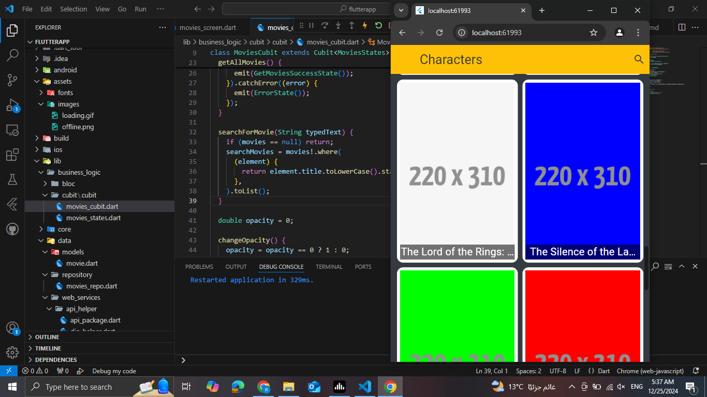
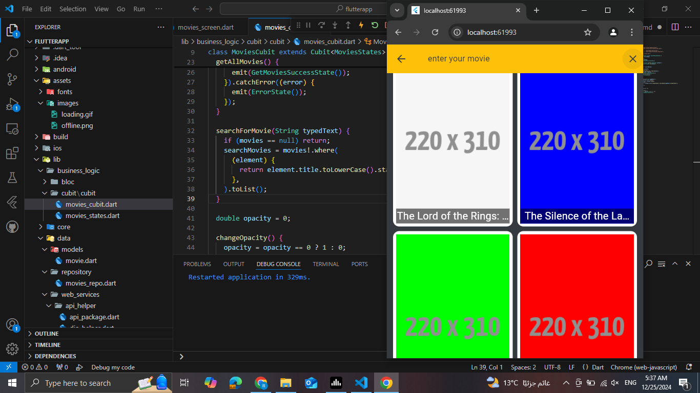
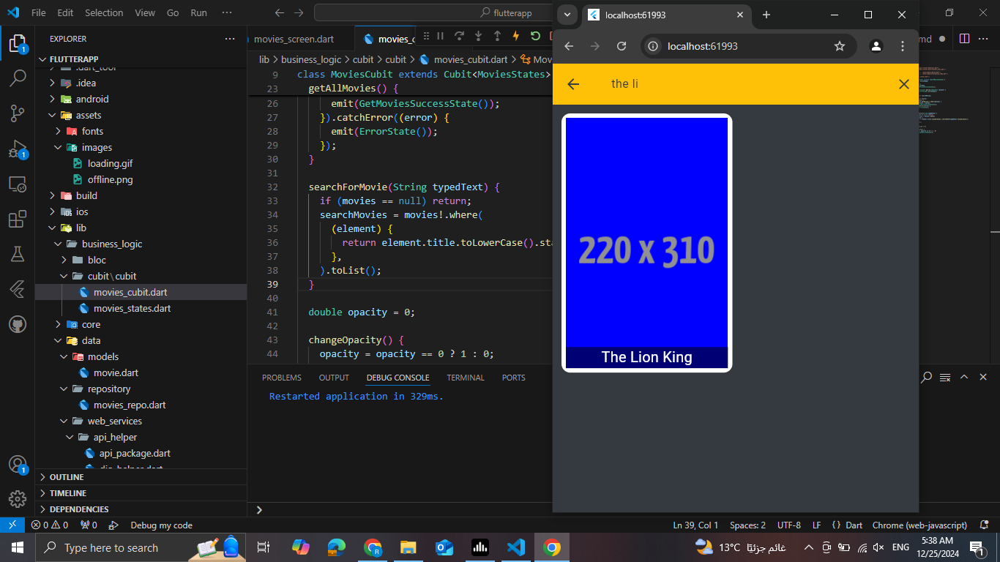
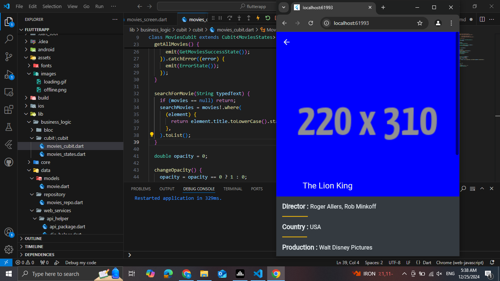
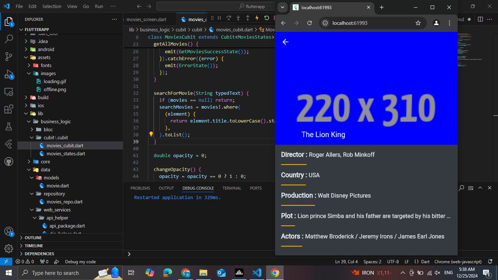
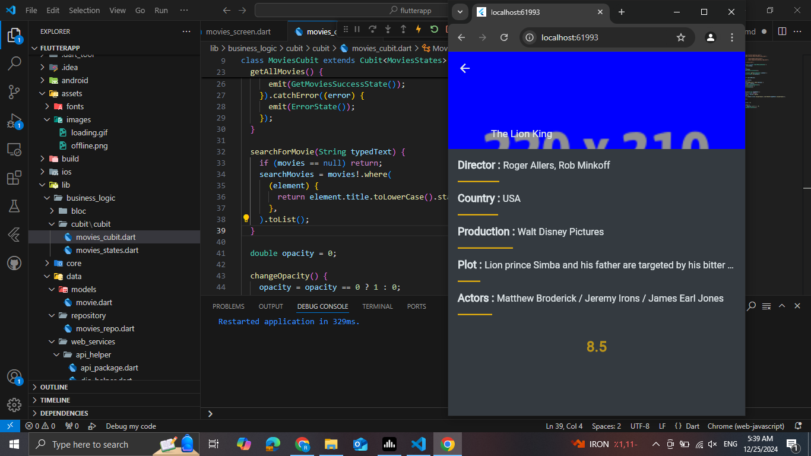
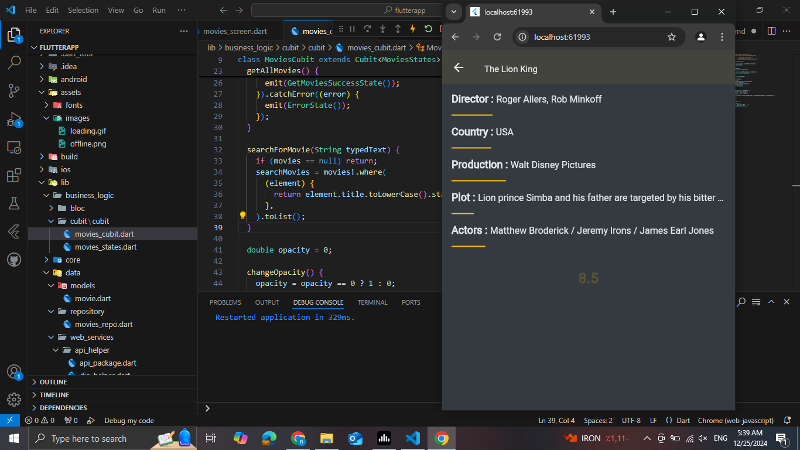
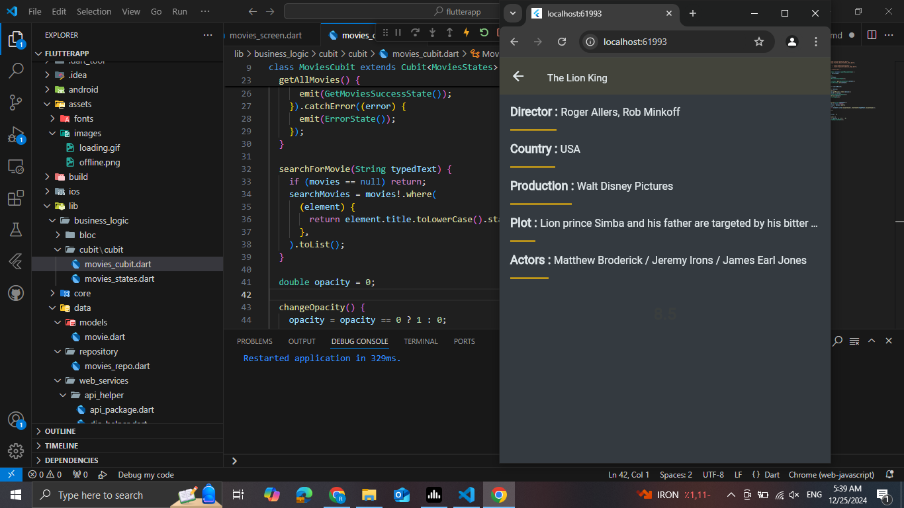
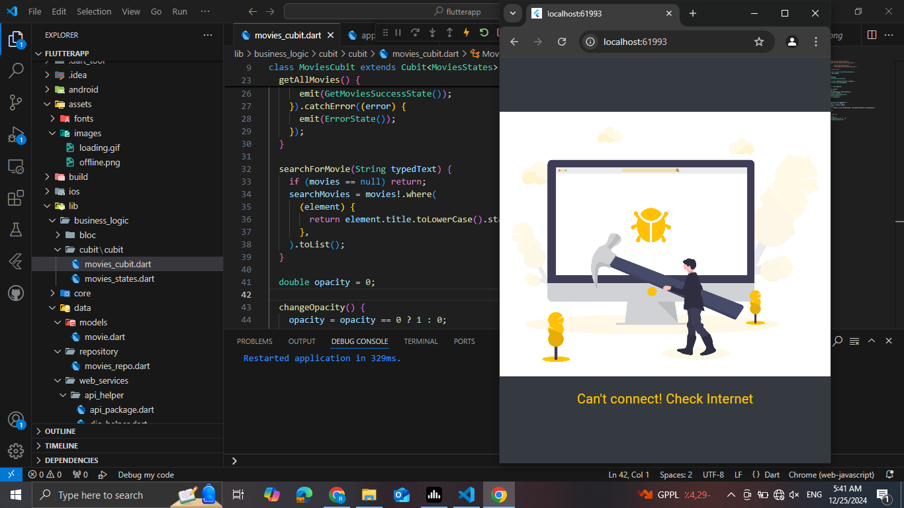
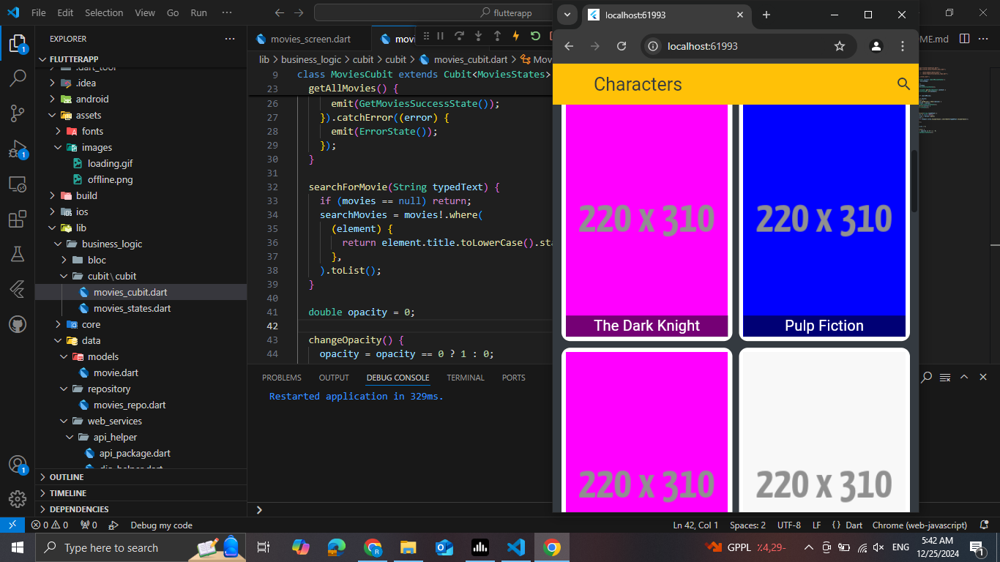

# MoviesApp   

This Flutter application showcases movies fetched from an API using Cubit state management. Key features include offline support, detailed movie information with animated ratings, and a search bar for finding movies by title. The app uses CustomScrollView for a responsive layout combining collapsible appbar and movie details.

