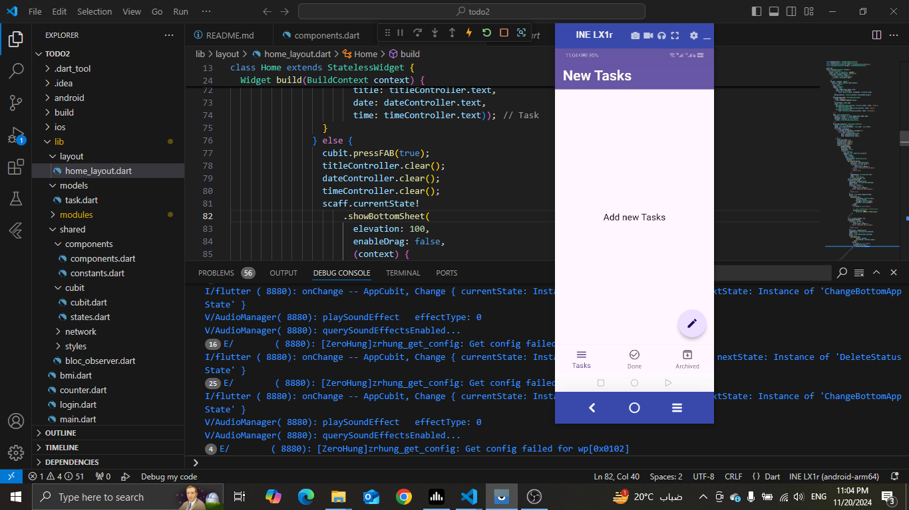
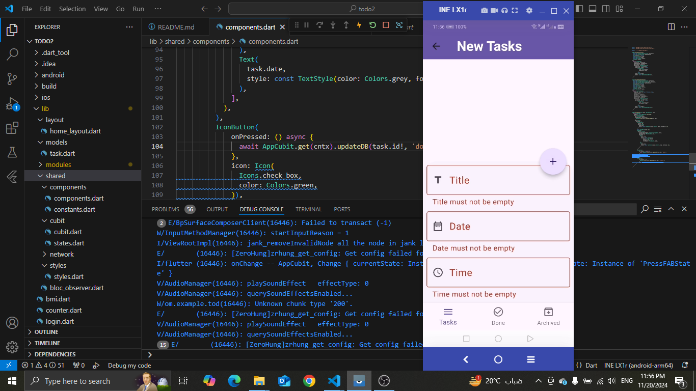
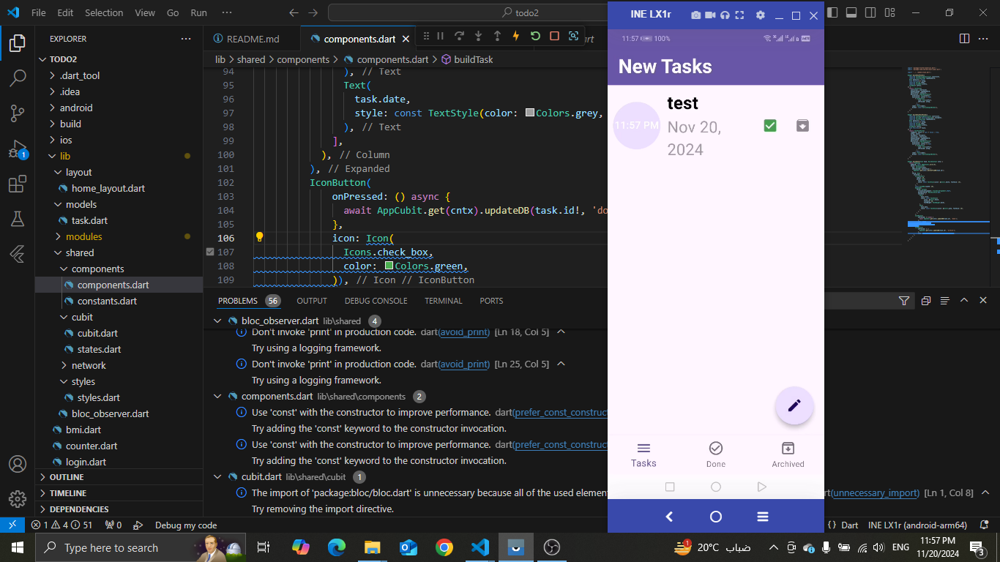
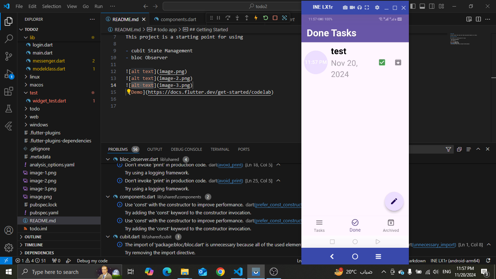

# todo app

A Flutter project that saves user tasks using sqflite based on its status.

## Getting Started

This project is a starting point for using 

- cubit State Management 
- bloc Observer

 [Demo](https://drive.google.com/file/d/1XlLgzTEzPe2OJwXguQ8D8HcZvfnzZn-J/view?usp=drive_link)

