# todo_app

To Do app to save user tasks using sqflite and remind him with local notification

# This project is a starting point for 

- SVG image
- GetX( GetStorage - obs - navigation without context - showing Dialog/BottomSheet/snakbar - check isDarkMode ..ect)
- flutter local notification

Demo [https://drive.google.com/file/d/18PFX7eTwyQFByAxW8ZoGZX7AM_mR04Hh/view?usp=drive_link]

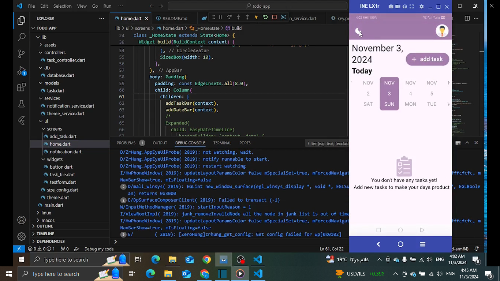
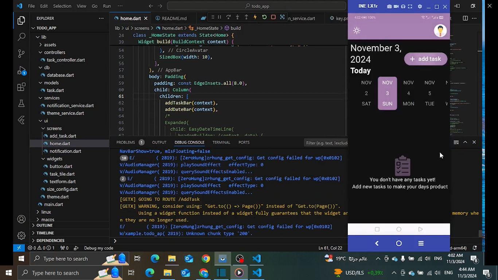
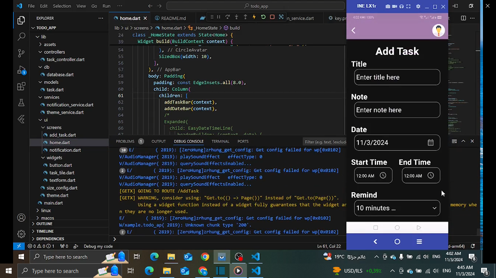
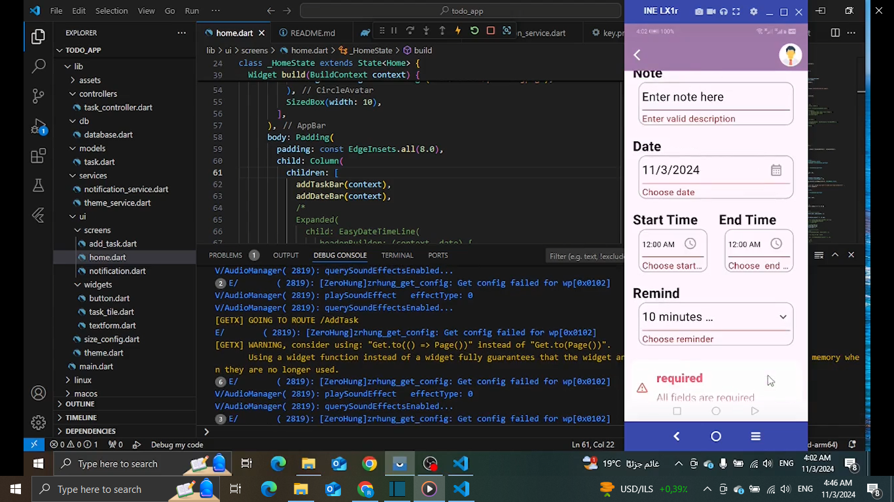
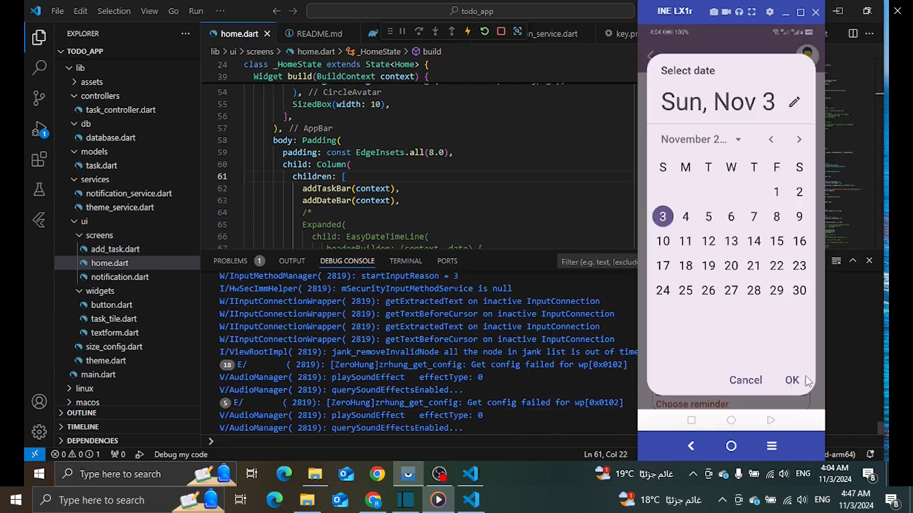
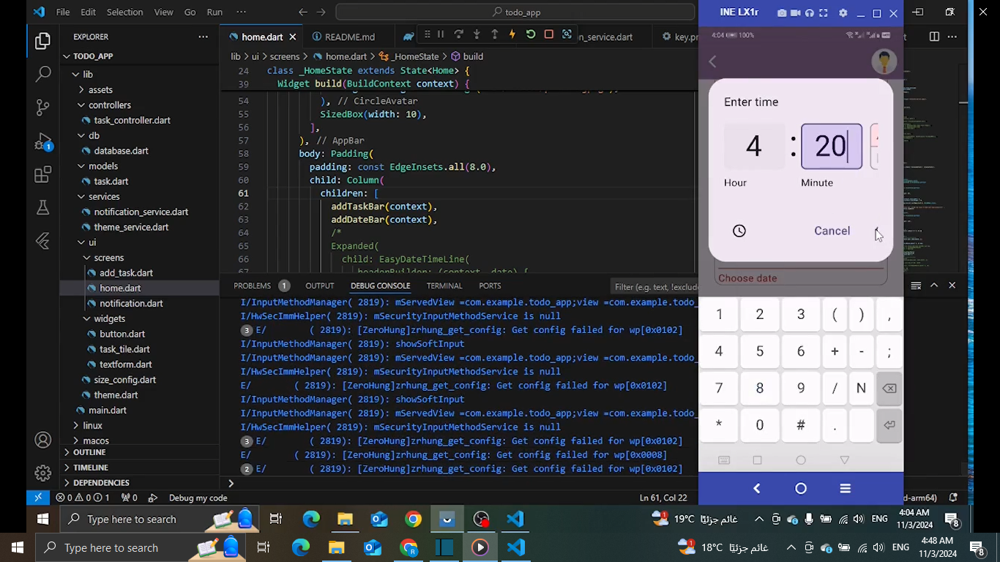
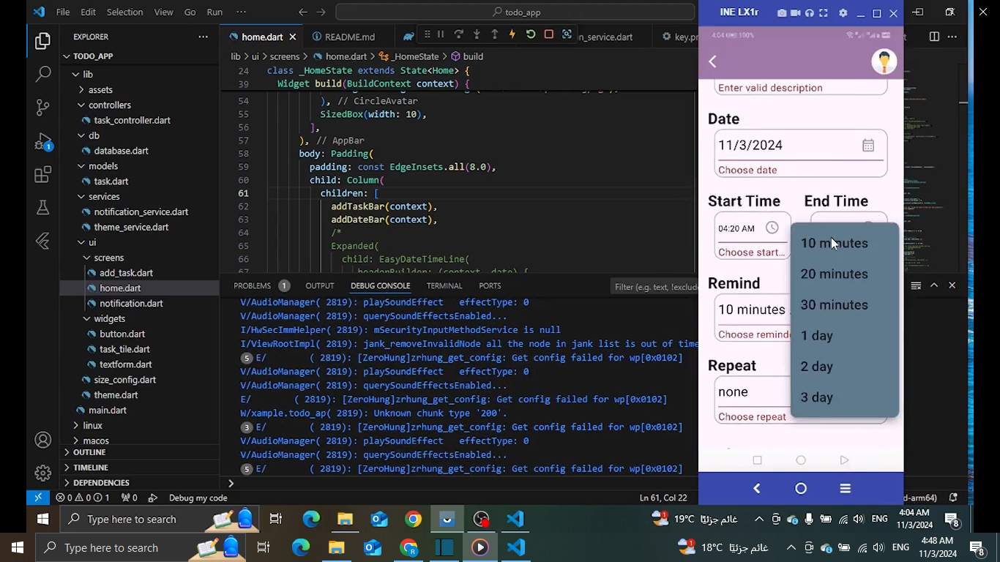
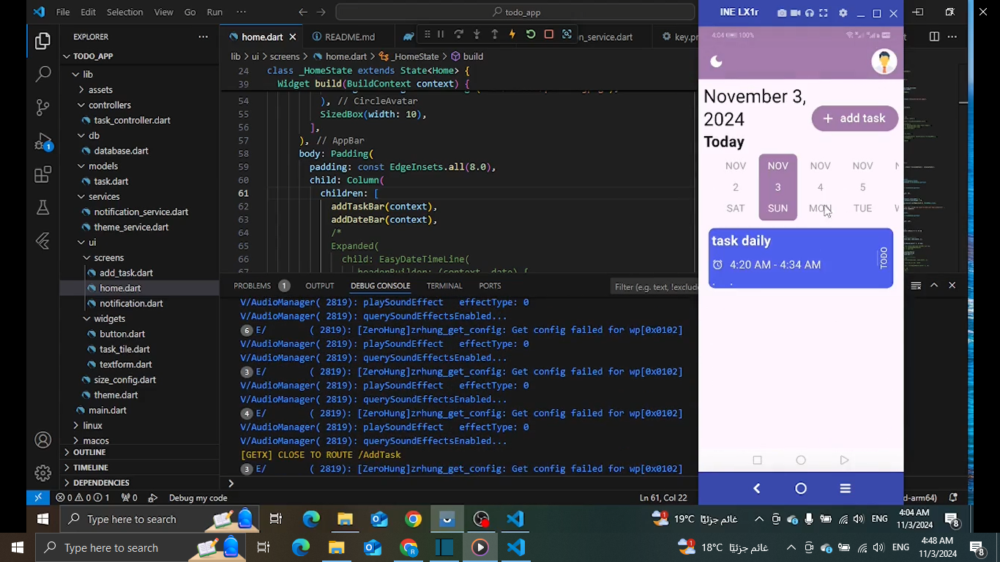
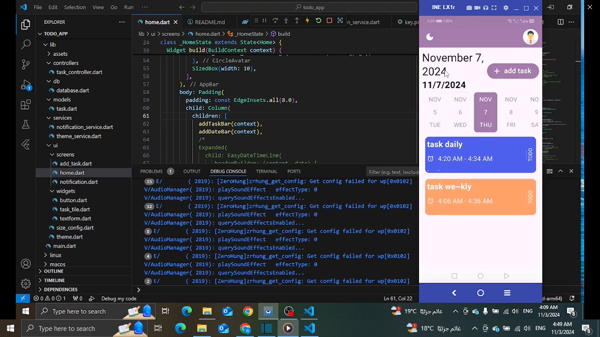
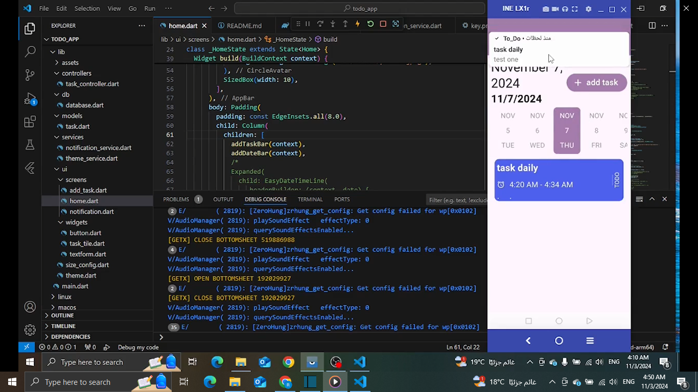
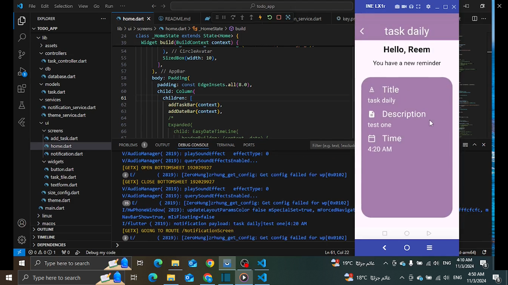